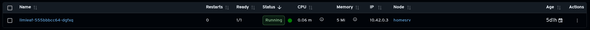
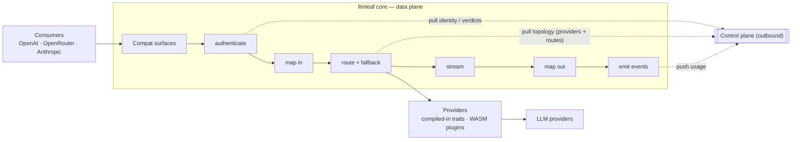

# llmleaf


llmleaf is a llm proxy. It proxies different llm providers and their slighty different apis and converts it a a single api surface.

## Goals:

- fast
- efficient
- light-weight
- extensible



## Features

- One stable endpoint in front of every provider — consumers speak OpenAI, OpenRouter, or
  Anthropic dialects; llmleaf maps them to one internal model and back.
- Streaming-first (SSE); a non-streaming response is just a collected stream.
- Modalities: chat, embeddings, rerank, text-to-speech, speech-to-text, realtime (WebSocket), batch jobs.
- Per-model fallback chains with node-local, health-aware switchover — no consensus or shared
  state, so N nodes run behind a plain load balancer.
- Opt-in per request/provider: Anthropic prompt caching, a unified thinking/reasoning-effort ladder.
- Responses API both ways: consumers can `POST /v1/responses` to *any* routed provider — upstreams
  without a Responses endpoint are served over their chat-completions wire transparently. Upstream,
  OpenAI and xAI speak their Responses APIs by default; OpenRouter's beta `POST /responses` (signed
  open-reasoning replay, routed cost), Groq's beta `POST /responses` (open unsigned reasoning), and
  Azure OpenAI's v1 surface (resource-scoped `POST /openai/v1/responses`) are per-provider opt-ins
  (`chat_api = "responses"`).
- Auth via HTTP-Basic key tokens (optional OAuth2/JWT); identity, limits, topology, and usage ride
  an **outbound** control plane (pull verdicts and provider/route config — diff-reconciled on every
  refresh — push usage). Fully operable from the config file alone.

### Supported providers

- **Native dialects:** Anthropic, Google Gemini, Vertex AI, Cohere, Ollama, LM Studio.
- **OpenAI-wire family:** OpenAI, OpenRouter, Requesty, Groq, DeepSeek, xAI (Grok), Mistral,
  Together, Fireworks, Perplexity, Cerebras, Z.AI (GLM), Moonshot (Kimi), MiniMax, Azure OpenAI.
  Moonshot additionally gets a dedicated provider layer that rewrites tool JSON schemas into the
  upstream's restricted "moonshot flavored JSON schema" (standard Pydantic/zod output otherwise 400s).
  Subscription plans ride dedicated kinds where the vendor gives them their own endpoint:
  `zai-coding` (GLM Coding Plan, `/api/coding/paas/v4`) and `kimi-coding` (Kimi for Coding,
  `api.kimi.com/coding/v1`); MiniMax's Token Plan shares the standard endpoint, so
  `minimax-token-plan` is an alias of `minimax` (only the key differs).
- `echo` for local testing.

## Quick start

```sh
# Run with the embedded dev config (echo provider, key `local-dev:s3cret`)
cargo run -p llmleaf

# …or point at your own config
cargo run -p llmleaf -- llmleaf.toml
```

Copy `llmleaf.example.toml`, fill in provider credentials (use `env:VAR` indirection — secrets
never live in the file), and pass it as the argument. Container image: `docker buildx bake image`
(listens on `:8080`). Send a request:

```sh
curl localhost:8080/v1/chat/completions \
  -H "Authorization: Bearer $(printf 'local-dev:s3cret' | base64)" \
  -d '{"model":"demo","messages":[{"role":"user","content":"hi"}]}'
```

> Base64 the `id:password` credential with **no trailing newline** — use `printf` (or `base64 -w0`),
> not `echo`. A stray newline is encoded into the value, so the decoded password becomes `pw\n` and
> fails the hash check → `401 unknown api key`, even when the configured `pw_hash` is correct.

See `llmleaf.example.toml` for the full configuration surface (providers, routes, keys, control plane).

## API surface

Consumer endpoints (OpenAI-compatible unless noted):

| Endpoint | Purpose |
|----------|---------|
| `POST /v1/chat/completions` | Chat (SSE streaming) |
| `POST /v1/messages` | Anthropic Messages dialect |
| `POST /v1/responses` | OpenAI Responses dialect (stateless; `store` always `false`, `GET /v1/responses/{id}` is a 404-by-design stub) |
| `POST /v1/embeddings` | Embeddings |
| `POST /v1/rerank` | Rerank (Cohere/Jina/OpenRouter dialect) |
| `POST /v1/audio/speech`, `GET /v1/audio/voices` | Text-to-speech |
| `POST /v1/audio/transcriptions` | Speech-to-text |
| `GET /v1/realtime` | OpenAI Realtime (WebSocket) |
| `POST /v1/batches`, `GET /v1/batches/{id}[/results]` | Batch jobs |
| `GET /v1/models`, `GET /v1/openapi.json`, `GET /healthz` | Discovery & health |

Read-only admin (optional token): `GET /admin/routes`, `/admin/health`, `/admin/keys`.
Official client SDKs for 6 languages live in [`clients/`](clients/).

## Architecture

Two strictly separated planes. The **core** (data plane) is the proxy; the **control plane** is
reached only outbound — the core pulls identity/verdicts/topology and pushes usage, never the
reverse. A pulled topology (`[control.topology]`) lets the controller also serve provider and route
configuration, diffed against the previous pull on every refresh so resources are added, updated,
and removed incrementally on top of the immutable config file. See [SOUL.md](SOUL.md) for the full
design constitution.



## License

Copyright (C) 2026 Fionn Langhans <fionnlanghans@codefionn.eu>.

llmleaf is free software licensed under the GNU Lesser General Public License,
version 3 or later (`LGPL-3.0-or-later`). The full text is in [`COPYING.LESSER`](COPYING.LESSER)
(the LGPLv3 terms) together with [`COPYING`](COPYING) (the GPLv3 it builds on).

Clients are licensed under MIT and APACHE-2.0 license.
