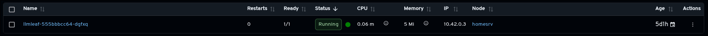
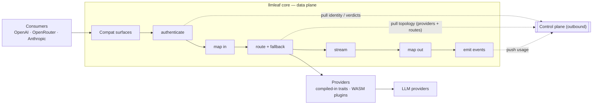

# llmleaf


llmleaf is a llm proxy. It proxies different llm providers and their slighty
different apis and converts it to a single api surface (enhanced
*openai-compatible* or anthropic).

The origin of this project is that other AI gateways focus on being all
encompassing and *fast*. I wanted a project that is slim, focused and near
native performance instead.

## Goals:

- fast
- efficient
- light-weight
- extensible



## Features

- Stable API endpoints for AI generation (OpenAI compatible, OpenRouter like and Anthropic Message API compatbile)
- Endpoint types: chat, embeddings, rerank, text-to-speech, speech-to-text,
  realtime (WebSocket), batch jobs
- Supported modalities: image, audio, video and of course text (though mainly image and text support is focused on)
- Health-aware AI endpoint switchover
- No shared state between instances, which simplifies hosting multiple instances greatly
- Prompt caching
- Reasoning effort selection
- Web socket support (also for SSE and even simple request-response providers)

Please use web sockets, it fixes latency and prompt caching issues.

### Supported providers

- **Native dialects:** Anthropic, Google Gemini, Vertex AI, Cohere, Ollama, LM Studio.
- **OpenAI-wire family:** OpenAI, Meta Model API (Muse), OpenRouter, Requesty, Groq, DeepSeek, xAI (Grok), Mistral,
  Together, Fireworks, Perplexity, Cerebras, Z.AI (GLM), Moonshot (Kimi), MiniMax, Amazon Bedrock,
  Hugging Face Inference Providers, DeepInfra, Cloudflare Workers AI, OCI Generative AI,
  Databricks Model Serving, NVIDIA NIM, Baidu AI Cloud Qianfan, Azure OpenAI.
  Moonshot additionally gets a dedicated provider layer that rewrites tool JSON schemas into the
  upstream's restricted "moonshot flavored JSON schema" (standard Pydantic/zod output otherwise 400s).
  Subscription plans ride dedicated kinds where the vendor gives them their own endpoint:
  `zai-coding` (GLM Coding Plan, `/api/coding/paas/v4`) and `kimi-coding` (Kimi for Coding,
  `api.kimi.com/coding/v1`); MiniMax's Token Plan shares the standard endpoint, so
  `minimax-token-plan` is an alias of `minimax` (only the key differs).
- `echo` for local testing.

## Quick start

```sh
# Run with the embedded dev config (echo provider, key `local-dev:s3cret`)
cargo run -p llmleaf

# …or point at your own config
cargo run -p llmleaf -- llmleaf.toml
```

Copy `llmleaf.example.toml`, fill in provider credentials (use `env:VAR` indirection — secrets
never live in the file), and pass it as the argument. Container image: `docker buildx bake image`
(listens on `:8080`). Send a request:

```sh
curl localhost:8080/v1/chat/completions \
  -H "Authorization: Bearer $(printf 'local-dev:s3cret' | base64)" \
  -d '{"model":"demo","messages":[{"role":"user","content":"hi"}]}'
```

> Base64 the `id:password` credential with **no trailing newline** — use `printf` (or `base64 -w0`),
> not `echo`. A stray newline is encoded into the value, so the decoded password becomes `pw\n` and
> fails the hash check → `401 unknown api key`, even when the configured `pw_hash` is correct.

See `llmleaf.example.toml` for the full configuration surface (providers, routes, keys, control plane).

## API surface

Consumer endpoints (OpenAI-compatible unless noted):

| Endpoint | Purpose |
|----------|---------|
| `POST /v1/chat/completions` | Chat (SSE streaming) |
| `POST /v1/messages` | Anthropic Messages dialect |
| `POST /v1/responses` | OpenAI Responses dialect (encrypted stateless replay and proxied `store`/`previous_response_id`; GET remains a 404-by-design stub) |
| `POST /v1/embeddings` | Embeddings |
| `POST /v1/rerank` | Rerank (Cohere/Jina/OpenRouter dialect) |
| `POST /v1/audio/speech`, `GET /v1/audio/voices` | Text-to-speech |
| `POST /v1/audio/transcriptions` | Speech-to-text |
| `GET /v1/realtime` | OpenAI Realtime (WebSocket) |
| `POST /v1/batches`, `GET /v1/batches/{id}[/results]` | Batch jobs (ids HMAC-signed + owner-bound with `[server].batch_id_secret`) |
| `GET /v1/models`, `GET /v1/openapi.json`, `GET /healthz` | Discovery & health |

Read-only admin (optional token): `GET /admin/routes`, `/admin/health`, `/admin/keys`.
Official client SDKs for 6 languages live in [`clients/`](clients/).

## Architecture

Two strictly separated planes. The **core** (data plane) is a Compio/Cyper server: ingress,
control-plane background I/O, and provider HTTP run on Compio. The separate `llmleaf-web`
control-plane app intentionally remains Tokio/Axum; its narrow compatibility bridges never put a
Tokio reactor or I/O loop in the data plane. The control plane is reached only outbound — the core
pulls identity/verdicts/topology and pushes usage, never the reverse. A pulled topology
(`[control.topology]`) lets the controller also serve provider and route configuration, diffed
against the previous pull on every refresh so resources are added, updated, and removed
incrementally on top of the immutable config file. See [SOUL.md](SOUL.md) for the full design
constitution. To build a compatible controller, see the
[external control-plane implementation guide](docs/external-control-plane.md).


```mermaid
flowchart LR
  Cons["Consumers<br/>OpenAI · OpenRouter · Anthropic"] --> Surf["Compat surfaces"]
  subgraph Core["llmleaf core — data plane"]
    direction LR
    Surf --> Auth["authenticate"] --> In["map in"] --> Route["route + fallback"] --> Stream["stream"] --> Out["map out"] --> Ev["emit events"]
  end
  Route --> Prov["Providers<br/>compiled-in traits · WASM plugins"]
  Prov --> Up["LLM providers"]
  Ctrl[["Control plane (outbound)"]]
  Auth -. "pull identity / verdicts" .-> Ctrl
  Route -. "pull topology (providers + routes)" .-> Ctrl
  Ev -. "push usage" .-> Ctrl
```

## AI Disclosure
This project is being developed with AI assistance.

## License

Copyright (C) 2026 Fionn Langhans <fionnlanghans@codefionn.eu>.

llmleaf and its clients are dual-licensed under either the
[MIT License](LICENSE-MIT) or the [Apache License 2.0](LICENSE-APACHE), at your option.
