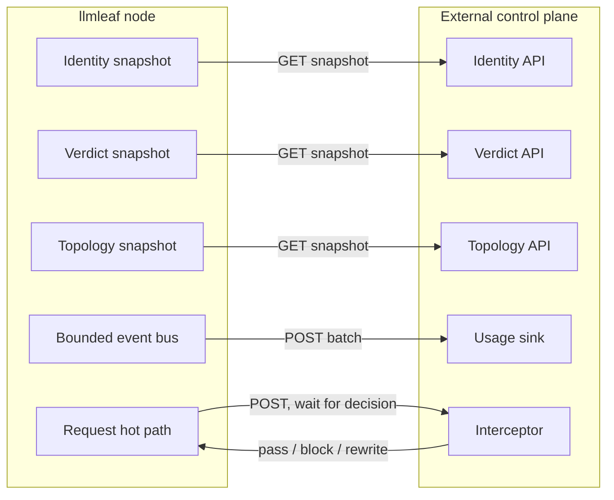
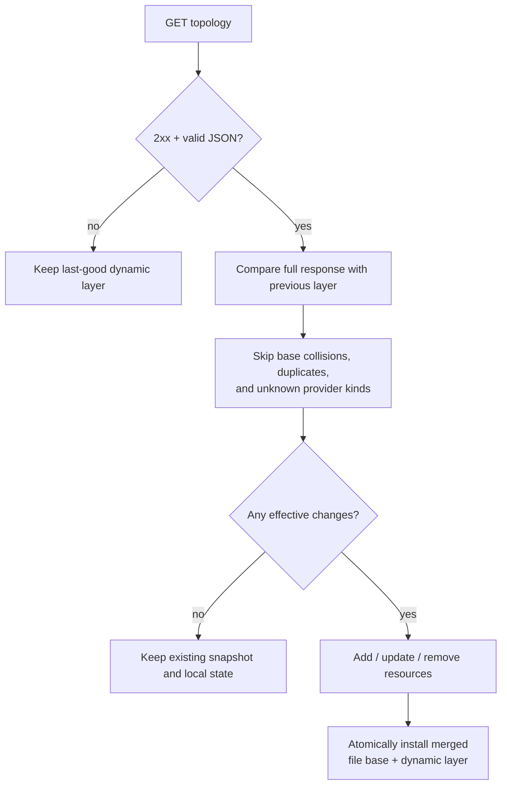
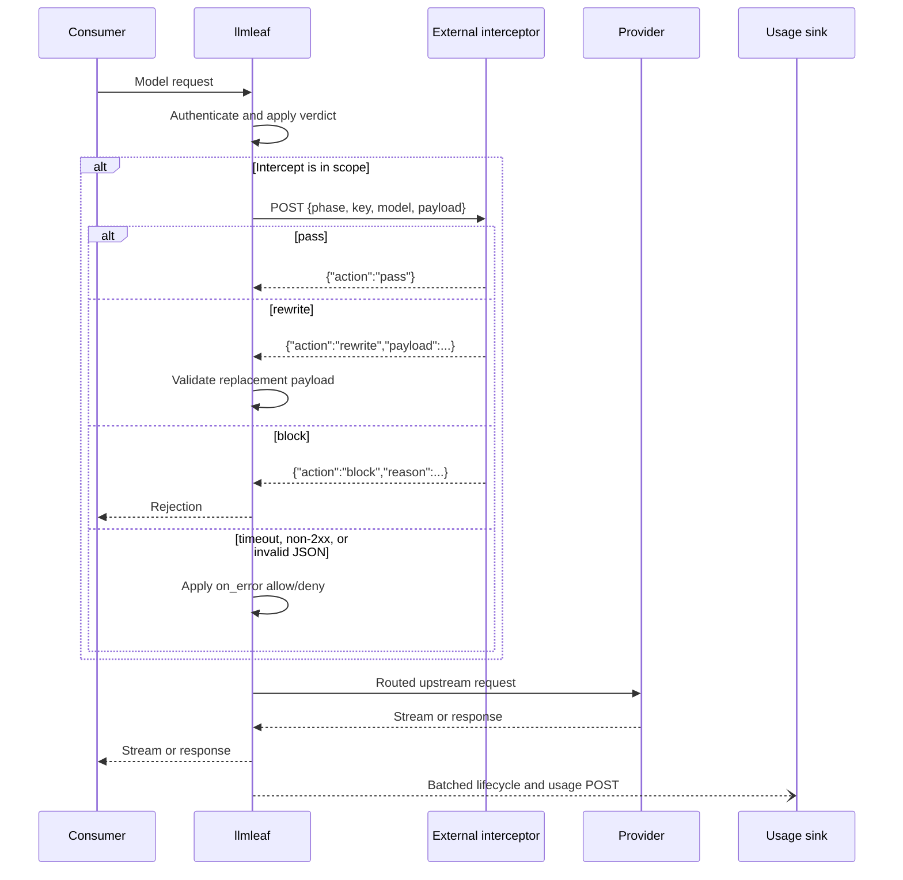
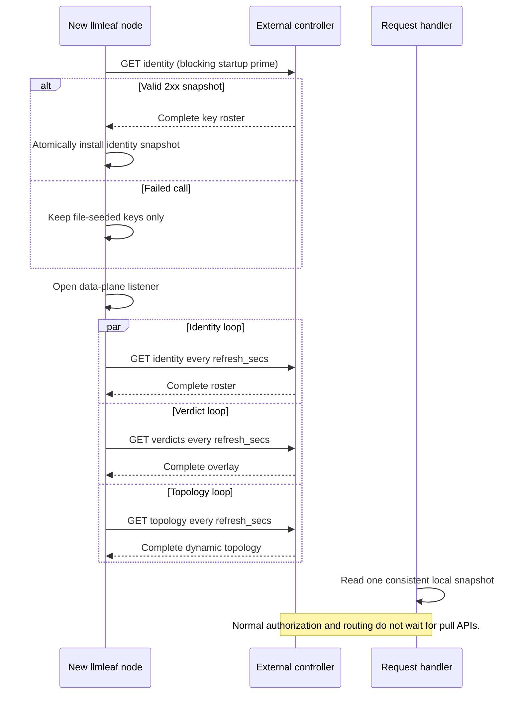

# Implementing an external control plane

This document defines the HTTP contract an external controller must implement to integrate with
llmleaf 0.1.x. The controller may be written in any language and may implement only the capabilities
that a deployment enables.

llmleaf uses an **inverted control plane**: every connection is initiated by an llmleaf node. A
controller never calls into a node and never mutates one directly. Nodes pull identity, verdict, and
topology snapshots; push lifecycle and usage events; and can synchronously ask an interceptor for a
request decision.

The words **MUST**, **SHOULD**, and **MAY** below describe interoperability requirements and
recommendations.

## Capability overview

Endpoint paths are not fixed. Each URL is configured independently, so the paths below are
conventions. The bundled `llmleaf-web` controller implements the identity, verdict, and usage paths.

| Capability | Direction, from llmleaf's perspective | Conventional endpoint | Required response |
| --- | --- | --- | --- |
| Identity | `GET` pull | `/llmleaf/keys` | `{"keys": [...]}` |
| Verdicts/limits | `GET` pull | `/llmleaf/verdicts` | `{"verdicts": {...}}` |
| Dynamic topology | `GET` pull | `/llmleaf/topology` | `{"providers": [...], "routes": [...]}` |
| Usage/lifecycle | `POST` push | `/llmleaf/usage` | Any `2xx`; body is ignored |
| Synchronous intercept | `POST` request/response | `/llmleaf/intercept` | `pass`, `block`, or `rewrite` |

All five capabilities are optional and independently configured. An external controller only
**MUST** implement the endpoints that the node configuration enables.



## Common HTTP contract

For every configured integration, a controller:

- **MUST** accept the configured HTTP method and URL.
- **MUST** return a `2xx` status for success. A timeout, transport error, or non-`2xx` status is a
  failed call. Invalid JSON is also a failure when llmleaf expects a response body; the usage response
  body is ignored.
- **MUST** return JSON matching the documented shape for pull and intercept responses.
- **MUST NOT** require an inbound connection to an llmleaf node.
- **SHOULD** use HTTPS and authenticate every production request.
- **SHOULD** produce complete snapshots atomically. Never expose a half-written roster or topology
  during an update.
- **SHOULD** tolerate additive fields and unknown usage event variants so a newer node can continue
  reporting to an older controller.
- **SHOULD** respond comfortably inside the configured timeout. A timeout is not extended merely
  because the controller is still doing work.

llmleaf has no application-level API version header in 0.1.x. Version the controller's URLs when
independent evolution is needed, for example `/v1/llmleaf/keys`.

### Authentication

llmleaf can send either:

```http
Authorization: Bearer <token>
```

or one configured custom header:

```http
X-API-Key: <value>
```

When a credential is configured, a controller **MUST** validate it before returning control data or
accepting events. It **SHOULD** use a constant-time secret comparison, avoid logging credential
values, and return `401 Unauthorized` or `403 Forbidden` for rejected credentials.

The node may also be configured with an inline `credential`; this is always sent as a bearer token.
An unset `env:VARIABLE` on the node means no authentication header is attached.

### TLS trust and custom certificate authorities

The shipped llmleaf 0.1.x binary has no TOML setting for a CA file, CA directory, client
certificate, or per-endpoint TLS policy. Keys such as `ca_cert` or `tls` in a `[control.*]` table are
unknown fields and cause configuration loading to fail. A `ca_cert` value placed in a provider's
free-form `settings` object is accepted as data but ignored by the shared HTTP transport.

Default certificate behavior is:

- Control pulls, usage pushes, intercept calls, OAuth/JWKS calls, and ordinary provider HTTPS calls
  use `reqwest` with its Rustls backend.
- The default Rustls verifier validates the server certificate chain and DNS name against the
  platform trust source. Self-signed certificates and certificates signed only by an unknown private
  CA are rejected.
- On Linux/BSD deployments, the platform verifier discovers the system CA bundle.
  `SSL_CERT_FILE` and `SSL_CERT_DIR` can override that discovery and are read when the process builds
  its clients.
- Provider HTTP traffic uses one shared client for both file-configured and dynamically pulled
  providers. Control traffic uses separate clients internally, but they use the same process-level
  trust source.
- Native provider Realtime uses a separate `tokio-tungstenite` client compiled with Mozilla
  `webpki-roots`. It does not use llmleaf's `reqwest` client or the provider HTTP trust configuration.

For a private CA on a Linux host or container, there are currently two supported operational
approaches:

1. Install the CA into the operating system or container trust store before starting llmleaf. This
   is the preferred global configuration for ordinary HTTPS.
2. Set `SSL_CERT_FILE` before starting llmleaf and point it at a PEM bundle containing both the
   normal public roots and the private roots llmleaf needs.

For example, after preparing `/etc/llmleaf/ca-bundle.pem` as a combined PEM bundle:

```bash
SSL_CERT_FILE=/etc/llmleaf/ca-bundle.pem llmleaf /etc/llmleaf/llmleaf.toml
```

Or in a systemd unit:

```ini
[Service]
Environment=SSL_CERT_FILE=/etc/llmleaf/ca-bundle.pem
ExecStart=/usr/local/bin/llmleaf /etc/llmleaf/llmleaf.toml
```

`SSL_CERT_FILE` and `SSL_CERT_DIR` are replacements for the automatically discovered trust
locations, not an additive llmleaf setting. A file containing only a private root can therefore
break connections to public providers. Use a combined bundle when one process must reach both. Set
the environment before process startup and restart llmleaf after rotating the bundle.

| Desired scope | Supported by the shipped binary? | Current approach |
| --- | --- | --- |
| All control and provider HTTP endpoints | Yes | OS/container trust store, or a combined `SSL_CERT_FILE` bundle |
| One control endpoint only | No | Use a CA trusted globally, terminate through a trusted proxy, or build a custom binary |
| One provider only | No | Use a CA trusted globally, terminate through a trusted proxy, or embed/build with a custom transport |
| Native provider `wss://` Realtime | No custom CA | Its current client uses compiled-in web PKI roots |
| Mutual TLS/client certificate | No | Not exposed by the current config or shipped client construction |
| Disable certificate or hostname checks | No | Deliberately not exposed |

Installing a CA does not disable hostname verification: the certificate still needs a subject
alternative name matching the hostname in the configured `https://` URL. Supply a CA/root or needed
intermediate certificate, not the server's private key. Control bearer/custom-header authentication
is independent of TLS trust and is still required when configured.

Library embedders have lower-level escape hatches that the shipped binary does not expose:
`ReqwestTransport::with_client` accepts a caller-built provider HTTP client, and the individual
control refresher/reporter/interceptor constructors accept a `reqwest::Client`. A custom client can
merge extra roots with `reqwest::ClientBuilder::tls_certs_merge`. This requires custom wiring and
does not create a TOML-level per-provider option.

### Failure and delivery semantics

There are deliberately no cross-node transactions:

| Capability | On a failed call | Retry behavior |
| --- | --- | --- |
| Identity | Startup continues with file-configured keys; a warm node keeps its last-good roster | Next scheduled poll |
| Verdicts | Keeps the last-good overlay; on a cold node there is no restriction overlay | Next scheduled poll |
| Topology | Keeps the last-good dynamic layer; on a cold node only file topology exists | Next scheduled poll |
| Usage | Drops the current batch | No retry |
| Intercept | Applies configured `on_error`: `allow` passes, `deny` blocks | No retry |

Identity is synchronously pulled once before the data-plane listener opens. Verdict and topology
pollers begin immediately in the background. Poll intervals use delayed ticks, so a slow response
does not cause catch-up bursts.

`on_error` is present in the identity and limits configuration surface, but their effective 0.1.x
behavior is fixed to the cache behavior in the table above. `on_error` currently changes behavior
only for synchronous interception.

## 1. Identity snapshot

```http
GET /llmleaf/keys
Accept: application/json
Authorization: Bearer ...
```

Response:

```json
{
  "keys": [
    {
      "id": "team-a",
      "pw_hash": "$2y$12$example-bcrypt-mcf-value",
      "allowed_models": ["gpt-4o", "openrouter/openai/*"]
    },
    {
      "id": "team-b",
      "pw_hash": "$6$example-sha512-crypt-mcf-value"
    }
  ]
}
```

### Identity fields

| Field | Type | Required | Meaning |
| --- | --- | --- | --- |
| `keys` | array | No; defaults to `[]` | The complete active identity roster |
| `id` | string | Yes | Stable, non-secret key ID; must not contain `:` |
| `pw_hash` | string | Yes | Unix `crypt(3)` MCF password hash, never plaintext |
| `name` | string | No | Log-safe display name used in events and intercept calls |
| `allowed_models` | string array | No | Base model allow-list; omitted or containing `"*"` means unrestricted |

`allowed_models` accepts exact model IDs and `*` glob patterns such as `gpt-*`,
`openrouter/openai/*`, and `*-mini`. An explicit empty array denies every model.

The roster is an authoritative full replacement:

- A successful response replaces the node's complete identity snapshot.
- A key omitted from the next successful response is revoked on that node.
- A successful `{}` or `{"keys":[]}` removes every pulled identity, including the file-seeded
  roster that was active before the first successful pull.
- Verdicts survive an identity refresh for IDs that remain in the roster.
- A changed `pw_hash` invalidates previously authenticated credentials.

The controller **MUST** return every identity that should remain active on every successful response.
It **MUST** store and return only password hashes. Supported hashes are standard Unix MCF strings,
including bcrypt (`$2...`) and `$1$`, `$5$`, or `$6$` crypt hashes.

Consumer credentials use `base64(id:password)` as the bearer value. The external controller does not
receive or construct this token, but its `id` and `pw_hash` must correspond to it.

> The verdict API is keyed by raw `id`. By contrast, usage and intercept payloads carry `name` when
> one is configured, otherwise `id`. A controller that sets names **MUST** retain the display-name to
> raw-ID mapping when it turns usage into verdicts. Names **SHOULD** be unique. Omitting `name` is the
> simplest way to keep all identifiers identical.

## 2. Verdict snapshot

```http
GET /llmleaf/verdicts
Accept: application/json
Authorization: Bearer ...
```

Response:

```json
{
  "verdicts": {
    "team-a": {
      "allowed_models": ["gpt-4o", "gpt-4o-mini"]
    },
    "team-b": {
      "blocked": true
    },
    "team-c": {
      "suspended_until": 1785031200
    }
  }
}
```

### Verdict fields

| Field | Type | Required | Meaning |
| --- | --- | --- | --- |
| `verdicts` | object keyed by identity `id` | No; defaults to `{}` | Complete verdict overlay |
| `blocked` | boolean | No; defaults to `false` | Hard block |
| `suspended_until` | unsigned integer | No | Block while current Unix time in seconds is less than this value |
| `allowed_models` | string array | No | Additional runtime model restriction |

Verdict precedence is `blocked` → `suspended_until` → identity allow-list → verdict allow-list.
The two model allow-lists are both enforced, so a verdict can narrow an identity's access but cannot
widen it. As with identity, a missing list or a list containing `"*"` is unrestricted, while an empty
list denies every model.

This response is also an authoritative snapshot:

- A key omitted from `verdicts` receives an empty, unrestricted verdict.
- A successful `{}` or `{"verdicts":{}}` clears all verdict restrictions.
- Verdicts for unknown identity IDs are ignored.
- A failed poll retains the previous verdict snapshot.

Controllers **SHOULD** omit unrestricted entries rather than sending empty objects. They **MUST** use
Unix **seconds**, not milliseconds, for `suspended_until`.

## 3. Dynamic topology snapshot

```http
GET /llmleaf/topology
Accept: application/json
Authorization: Bearer ...
```

Response:

```json
{
  "providers": [
    {
      "name": "openai-dynamic",
      "kind": "openai",
      "credential": "env:OPENAI_API_KEY",
      "settings": {
        "organization": "org-example"
      },
      "limits": {
        "requests_per_min": 1000,
        "tokens_per_min": 200000,
        "max_concurrent": 50
      },
      "model_limits": {
        "gpt-4o": {
          "requests_per_min": 500
        }
      }
    },
    {
      "name": "openrouter-dynamic",
      "kind": "openrouter",
      "prefix": "or",
      "credential": "env:OPENROUTER_API_KEY"
    }
  ],
  "routes": [
    {
      "model": "smart",
      "targets": [
        {
          "provider": "openai-dynamic",
          "model": "gpt-4o"
        },
        {
          "provider": "openrouter-dynamic",
          "model": "anthropic/claude-sonnet-4"
        }
      ]
    }
  ]
}
```

### Provider fields

| Field | Type | Required | Meaning |
| --- | --- | --- | --- |
| `name` | string | Yes | Unique provider instance name |
| `kind` | string | Yes | Provider implementation known to the running llmleaf binary |
| `endpoint` | string | No | Override the provider's default upstream base URL |
| `credential` | string | No | Literal upstream credential or `env:VARIABLE` resolved on each node |
| `prefix` | string | No | Route unmatched `<prefix>/<model>` requests to this provider |
| `settings` | object | No; defaults to `{}` | Provider-specific settings |
| `limits` | object | No | Provider-wide node-local rate limits |
| `model_limits` | object | No; defaults to `{}` | Rate limits keyed by upstream model ID |

Each rate-limit object supports optional `requests_per_min` (integer), `tokens_per_min` (integer),
and `max_concurrent` (integer). Omitted dimensions are unlimited.

The built-in binary recognizes the provider kinds listed by
`llmleaf-providers::known_kinds`; common canonical values include `openai`, `openrouter`,
`anthropic`, `gemini`, `vertex`, `cohere`, `ollama`, `lmstudio`, and `echo`. See
[`llmleaf.example.toml`](../llmleaf.example.toml) for the current full list, aliases, and
provider-specific settings.

### Route fields

| Field | Type | Required | Meaning |
| --- | --- | --- | --- |
| `model` | string | Yes | Logical model ID requested by consumers |
| `targets` | array | Yes | Ordered fallback chain |
| `targets[].provider` | string | Yes | Provider instance name |
| `targets[].model` | string | No | Upstream model ID; defaults to the logical model |

Topology is a complete dynamic snapshot, not a patch:

- A successful response is diffed against the previous successful dynamic snapshot.
- New resources are added, changed resources updated, and omitted resources removed.
- An unchanged provider retains its node-local rate buckets and health state.
- `{}`, or two empty arrays, deliberately removes all dynamic providers and routes.
- File-configured providers and routes are immutable and always win name/model collisions. Colliding
  dynamic entries are skipped.
- Duplicate dynamic provider names or route models are skipped; the first entry wins.
- Unknown provider kinds are skipped.
- Unknown fields in provider, rate-limit, route, or target objects make the JSON pull invalid. The
  controller **MUST NOT** send speculative fields in these objects.

The controller **SHOULD** return `env:VARIABLE` credential references and provision those variables
on nodes, instead of transmitting upstream provider secrets in this response.



## 4. Usage and lifecycle ingestion

llmleaf sends batches asynchronously:

```http
POST /llmleaf/usage
Content-Type: application/json
Authorization: Bearer ...
```

```json
{
  "events": [
    {
      "ts_ms": 1785024000000,
      "event": "request_started",
      "id": "req-01",
      "key": "team-a",
      "model": "smart"
    },
    {
      "ts_ms": 1785024000020,
      "event": "request_routed",
      "id": "req-01",
      "provider": "openai-dynamic",
      "upstream_model": "gpt-4o"
    },
    {
      "ts_ms": 1785024000900,
      "event": "usage",
      "id": "req-01",
      "key": "team-a",
      "model": "smart",
      "usage": {
        "prompt_tokens": 120,
        "completion_tokens": 42,
        "total_tokens": 162,
        "cost_usd": 0.00123,
        "cache_read_tokens": 80,
        "cache_creation_tokens": 12
      }
    },
    {
      "ts_ms": 1785024000910,
      "event": "request_completed",
      "id": "req-01",
      "finish": "stop"
    }
  ]
}
```

Every event is a flattened envelope with `ts_ms` in Unix **milliseconds** and a snake-case `event`
tag:

| Event | Fields |
| --- | --- |
| `request_started` | `id`, `key`, `model`, optional `request` |
| `request_routed` | `id`, `provider`, `upstream_model` |
| `usage` | `id`, `key`, `model`, `usage` |
| `request_completed` | `id`, optional `finish` |
| `request_failed` | `id`, `error` |
| `provider_health` | `provider`, `status` |

The `usage` object contains `prompt_tokens`, `completion_tokens`, and `total_tokens`, which default
to zero, plus optional `cost_usd`. It may also contain `cache_read_tokens` and
`cache_creation_tokens`; these are omitted when zero. The field is named `cost_usd`, not `cost`.
Known completion reasons are `stop`, `length`, `tool_calls`, `content_filter`, and `error`.

When `server.include_payloads = true`, `request_started.request` contains the canonical request
payload. This can contain prompts and other sensitive data. A controller **MUST** apply appropriate
access controls, retention, and redaction when accepting it.

The usage sink:

- **MUST** accept an `events` array and return any `2xx` after it has accepted the batch.
- **SHOULD** accept an empty array, though llmleaf does not intentionally send empty batches.
- **SHOULD** tolerate unknown event variants and additive fields.
- **SHOULD** ingest a batch transactionally.
- **SHOULD** make storage idempotent using an event identity derived from its fields if the surrounding
  infrastructure can replay requests.
- **MUST NOT** assume delivery is complete or ordered across nodes.

Events sit in a bounded, node-local broadcast ring. If the reporter lags, old events are dropped. If a
POST fails, that batch is dropped. There is no retry, disk spool, acknowledgement cursor, or
back-pressure to the request path. Use the stream for observation and best-effort accounting; do not
mistake it for an exactly-once audit log.

The response body is ignored. A conventional response is:

```json
{"ingested": 4}
```

## 5. Synchronous interception

Interception is the only control call on the request hot path. It is gated locally by configured
phases, key display IDs, and logical models before llmleaf serializes or sends anything.

Request:

```http
POST /llmleaf/intercept
Content-Type: application/json
Authorization: Bearer ...
```

```json
{
  "phase": "request",
  "key": "team-a",
  "model": "smart",
  "payload": {
    "model": "smart",
    "messages": [
      {
        "role": "user",
        "content": [
          {
            "type": "text",
            "text": "Summarize this report"
          }
        ]
      }
    ],
    "stream": true
  }
}
```

The payload is llmleaf's canonical request object, not necessarily the consumer's original wire
shape. It varies by modality: chat, embeddings, rerank, speech, and transcription all use their
canonical model. A transcription payload omits raw audio bytes.

Valid responses are:

```json
{"action": "pass"}
```

```json
{"action": "block", "reason": "policy category disallowed"}
```

```json
{
  "action": "rewrite",
  "payload": {
    "model": "smart",
    "messages": [
      {
        "role": "user",
        "content": [
          {
            "type": "text",
            "text": "[redacted]"
          }
        ]
      }
    ],
    "stream": true
  }
}
```

For `rewrite`, the returned `payload` replaces the complete canonical payload. It **MUST**
deserialize as the same request type; it is not a merge patch. A missing required field, wrong type,
or otherwise invalid rewrite blocks the consumer request.

The controller:

- **MUST** return exactly one recognized action: `pass`, `block`, or `rewrite`.
- **MUST** include a complete valid `payload` for `rewrite`.
- **SHOULD** return a safe, user-facing `reason` when blocking. If omitted, llmleaf uses
  `"blocked by interceptor"`.
- **SHOULD** preserve fields it does not intend to change.
- **SHOULD** keep processing well below `timeout_ms`, because this latency is added directly to the
  consumer request.
- **MUST** treat payloads as sensitive.

In llmleaf 0.1.x, only `phase = "request"` is wired into the engine. Configuring `"response"` logs a
warning but produces no response-phase calls. Batch creation is not currently intercepted.



## Node configuration example

```toml
[[control.auth]]
id = "controller"
kind = "bearer"
token = "env:LLMLEAF_CONTROL_TOKEN"

[[control.auth]]
id = "screener"
kind = "header"
header = "X-API-Key"
value = "env:LLMLEAF_SCREENER_KEY"

[control.identity]
url = "https://control.example/v1/llmleaf/keys"
auth = "controller"
refresh_secs = 30
timeout_ms = 2000

[control.limits]
url = "https://control.example/v1/llmleaf/verdicts"
auth = "controller"
refresh_secs = 5
timeout_ms = 2000

[control.topology]
url = "https://control.example/v1/llmleaf/topology"
auth = "controller"
refresh_secs = 30
timeout_ms = 2000

[control.usage]
url = "https://control.example/v1/llmleaf/usage"
auth = "controller"
batch_ms = 1000
batch_max = 256
timeout_ms = 5000

[control.intercept]
url = "https://screen.example/v1/llmleaf/intercept"
auth = "screener"
phases = ["request"]
keys = ["team-a"]
models = ["smart"]
timeout_ms = 1000
on_error = "allow"
```

If a sub-table does not need shared or custom-header authentication, replace `auth = "controller"`
with `credential = "env:LLMLEAF_CONTROL_TOKEN"`. A sub-table cannot set both.

Defaults are:

| Setting | Default |
| --- | --- |
| Identity refresh | 30 seconds |
| Verdict refresh | 5 seconds |
| Topology refresh | 30 seconds |
| Pull timeout | 2000 ms |
| Usage flush interval | 1000 ms |
| Usage maximum batch | 256 events |
| Usage timeout | 5000 ms |
| Intercept timeout | 1000 ms |
| Intercept `on_error` | `allow` |

## Minimal controller pseudocode

The storage operations are intentionally abstract; production implementations should transact
snapshot reads and batch writes in their database.

```text
GET /v1/llmleaf/keys:
    authenticate(request)
    keys = database.read_complete_identity_snapshot()
    return 200 JSON {"keys": keys}

GET /v1/llmleaf/verdicts:
    authenticate(request)
    verdicts = database.read_complete_verdict_snapshot_by_raw_key_id()
    return 200 JSON {"verdicts": verdicts}

GET /v1/llmleaf/topology:
    authenticate(request)
    topology = database.read_complete_dynamic_topology_snapshot()
    return 200 JSON topology

POST /v1/llmleaf/usage:
    authenticate(request)
    validate request.body.events as an array
    database.transaction:
        for event in events:
            store_known_fields_and_preserve_or_ignore_unknown_fields(event)
    return 202 JSON {"ingested": length(events)}

POST /v1/llmleaf/intercept:
    authenticate(request)
    decision = policy.evaluate(request.body.phase,
                               request.body.key,
                               request.body.model,
                               request.body.payload)
    return 200 JSON decision
```

Example probes:

```bash
curl --fail-with-body \
  -H "Authorization: Bearer $LLMLEAF_CONTROL_TOKEN" \
  https://control.example/v1/llmleaf/keys

curl --fail-with-body \
  -H "Authorization: Bearer $LLMLEAF_CONTROL_TOKEN" \
  https://control.example/v1/llmleaf/verdicts

curl --fail-with-body \
  -H "Authorization: Bearer $LLMLEAF_CONTROL_TOKEN" \
  https://control.example/v1/llmleaf/topology

curl --fail-with-body \
  -H "Authorization: Bearer $LLMLEAF_CONTROL_TOKEN" \
  -H "Content-Type: application/json" \
  -d '{"events":[]}' \
  https://control.example/v1/llmleaf/usage

curl --fail-with-body \
  -H "X-API-Key: $LLMLEAF_SCREENER_KEY" \
  -H "Content-Type: application/json" \
  -d '{"phase":"request","key":"team-a","model":"smart","payload":{"model":"smart","messages":[],"stream":false}}' \
  https://screen.example/v1/llmleaf/intercept
```

## End-to-end state flow



## Production checklist

An interoperable production controller:

- **MUST** implement every enabled method and payload exactly as described.
- **MUST** treat identity, verdict, and topology responses as complete snapshots.
- **MUST** use raw identity IDs as verdict map keys.
- **MUST** never return plaintext consumer passwords.
- **MUST** use seconds for `suspended_until` and milliseconds for event `ts_ms`.
- **MUST** return a `2xx` only after accepting a usage batch.
- **MUST** return complete canonical payloads for intercept rewrites.
- **SHOULD** protect all endpoints with TLS and authentication.
- **SHOULD** use a combined public/private CA bundle when configuring `SSL_CERT_FILE`.
- **SHOULD** publish pull snapshots atomically and validate them before exposure.
- **SHOULD** tolerate new usage fields and event variants.
- **SHOULD** monitor pull latency/error rates, usage batch rejection, ingestion lag, and intercept
  latency.
- **SHOULD** alert before identity or topology data accidentally becomes an empty successful
  snapshot.
- **SHOULD** test outage behavior for both cold and warm nodes.

The bundled `llmleaf-web` component is a working reference for identity, verdict, and usage
endpoints. Its wire types live in
[`crates/llmleaf-web/src/wire.rs`](../crates/llmleaf-web/src/wire.rs), and the node-side clients live
in [`crates/llmleaf-control/src`](../crates/llmleaf-control/src).
